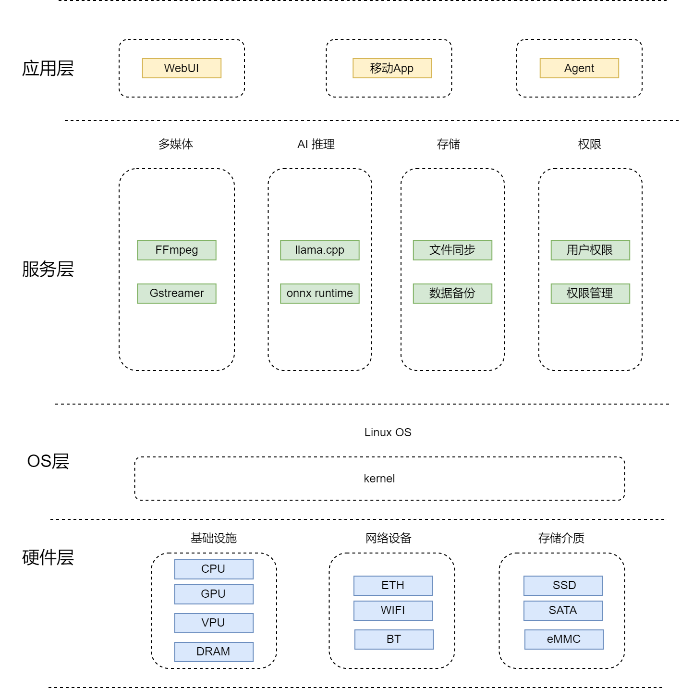

# AI NAS

**NAS** (Network Attached Storage) is a dedicated storage device that provides file, object, backup, media, and application services over network protocols. **AI NAS** (AI Network Attached Storage) extends traditional NAS storage capabilities with local AI inference. Unlike traditional NAS devices that only provide file storage and sharing, AI NAS can perform image recognition, video analysis, intelligent search, multimodal Q&A, and other AI tasks locally, keeping data off the cloud while improving privacy and latency.

## Core Capabilities

- **Image intelligence**: automatic image classification and tagging, face recognition and album clustering, image-based search, and EXIF metadata extraction.
- **Video intelligence**: video content analysis and scene splitting, intelligent editing and summarization, real-time video object detection and alerts.
- **Document intelligence**: OCR, PDF/Office document parsing, semantic vectorization, and full-text search.
- **Local Q&A**: large language model deployment (RAG), knowledge base management, multi-turn dialogue, and context memory.
- **Model management**: local model download, version switching, quantized format support, and CPU inference backend configuration.

## Platform Support

| Platform & OS | Support |
|---|---|
| K1 Buildroot | ✅ Yes |
| K1 OpenHarmony | ❌ No |
| K1 Bianbu LXQt/GNOME | ✅ Yes |
| K3 Buildroot | ✅ Yes |
| K3 OpenHarmony | ❌ No |
| K3 Bianbu LXQt/GNOME | ✅ Yes |

## Technical Architecture

### System Architecture Diagram



## Development Environment

| Development environment | Use case | Key advantages |
|---|---|---|
| Buildroot | Embedded firmware, minimized system images, lightweight products | Small image size, fast boot, high controllability |
| Debian | Feature validation, application ecosystem, higher-end products | Complete APT/OMV/Docker ecosystem and convenient development |

### Buildroot Development Environment

The Linux SDK built with Buildroot supports SpacemiT K-series chips. It includes the supervisor interface (OpenSBI), bootloader (U-Boot/UEFI), Linux kernel, root filesystem (including middleware and libraries), and examples. Its goal is to provide Linux support for the processor and enable driver or application development.

#### K1 Buildroot

[K1 Buildroot development documentation](https://www.spacemit.com/community/document/info?lang=en&nodepath=software/SDK/buildroot/k1_buildroot)

[K1 Buildroot source download](https://www.spacemit.com/community/resources-download/SDK/K1/Buildroot)

#### K3 Buildroot

[K3 Buildroot development documentation](https://www.spacemit.com/community/document/info?lang=en&nodepath=software/SDK/buildroot/k3_buildroot)

[K3 Buildroot source download](https://www.spacemit.com/community/resources-download/SDK/K3/Buildroot)

### Debian Development Environment

The Debian development environment is based on Bianbu OS, SpacemiT's official Debian-derived distribution. Bianbu is an operating system deeply optimized for RISC-V processors. It is built from Ubuntu community source code and provides the system foundation for SpacemiT AI CPUs. Bianbu provides the following images for developers and users:

- **GNOME desktop edition**: a native desktop edition preinstalled with GNOME Shell, Chromium, LibreOffice, MPV, and other applications.
- **LXQt desktop edition**: a lightweight desktop redesigned and developed based on LXQt for scenarios with strict resource and performance requirements.
- **Minimal edition**: a minimal system image that provides a command-line interface.

The Debian NAS solution is developed based on the Bianbu Minimal edition. K1 Bianbu 2.0 is built from Ubuntu 24.04 community sources, and K3 Bianbu 4.0 is built from Ubuntu 26.04 community sources.

The Bianbu development environment and the Buildroot development environment share the same BSP source code.

#### K1 Bianbu Image

[K1 Bianbu Minimal image](https://www.spacemit.com/community/resources-download/Images%20Collects/K1/Bianbu)

#### K3 Bianbu Image

[K3 Bianbu Minimal image](https://www.spacemit.com/community/resources-download/Images%20Collects/K3/Bianbu)

#### Custom Rootfs Image

[Bianbu rootfs creation](https://www.spacemit.com/community/document/info?lang=zh&nodepath=software/SDK/bianbu/system_integration)

## Multimedia Feature Development

The VPU on the SpacemiT platform is implemented based on the V4L2 framework and provides hardware video encoding and decoding.

- **Decode formats**: H.264 / HEVC / VP8 / VP9 / MJPEG / MPEG-4
- **Encode formats**: H.264 / HEVC / VP8 / VP9 / MJPEG

### FFmpeg User Guide

[FFmpeg user guide](https://www.spacemit.com/community/document/info?lang=en&nodepath=software/SDK/buildroot/k3_buildroot/media/ffmpeg_user_guide.md)

### GStreamer User Guide

[GStreamer user guide](https://www.spacemit.com/community/document/info?lang=en&nodepath=software/SDK/buildroot/k3_buildroot/media/gstreamer_user_guide.md)

## AI Feature Development

### AI Development Environment

#### Buildroot AI Development Environment

The Buildroot release has integrated `llama.cpp` and `spacemit-onnxruntime`.

#### Bianbu AI Development Environment

Install `llama.cpp`:

```bash
sudo apt update
sudo apt install llama.cpp-tools-spacemit
```

Install `spacemit-onnxruntime`:

```bash
sudo apt-get update
sudo apt-get install -y spacemit-onnxruntime libopencv-dev python3-spacemit-ort python3-pillow python3-matplotlib python3-opencv
```

### AI Features

AI NAS can use SpacemiT's intelligent computing platform [AI SDK](https://www.spacemit.com/community/document/info?lang=en&nodepath=ai/application_tools/ai-sdk.md) to implement the following AI features.

#### Intelligent Media Library

- **Image recognition**: classification, object detection, face detection, face features, emotion recognition, and pose recognition.
- **Video analysis**: frame extraction, object detection, multi-object tracking, and key-frame summarization.
- **Album features**: person clustering, scene tags, duplicate image detection, and natural language search.
- **Media Q&A**: VLM generates image descriptions and supports queries such as "What is in this image?" and "Find photos with cats."

#### Private Knowledge Base and RAG

- **Document ingestion**: PDF, TXT, Markdown, Office documents, and OCR text extracted from images.
- **Vectorization**: generate knowledge bases by shared directory, user, project, or tag.
- **Retrieval-augmented Q&A**: the LLM SDK `/api/chat` API supports `kb_ids` for RAG Q&A against specified knowledge bases.
- **Knowledge base management**: the LLM SDK provides APIs for knowledge base creation, file upload, vectorization, progress queries, chunk debugging, and deletion.
- **Asset service**: the LLM SDK Assets API can proxy MinIO static files and supports Range requests, making it suitable for document, audio, and image previews.

#### Voice and Meeting Center

- **ASR**: transcribe audio files for meeting recordings, personal voice notes, and video subtitle generation.
- **TTS**: convert text to speech for voice announcements and headless device interaction.
- **VAD**: voice activity detection to reduce silent segment processing.
- **Voiceprint / speaker diarization**: identify speakers in multi-speaker meeting records and family member scenarios.

#### Local AI Assistant

- **Local chat**: the LLM SDK, llama-server, or Ollama provides OpenAI-compatible or REST APIs.
- **Model management**: download, cancel download, start, stop, switch the current model, and query service status.
- **Session management**: create sessions, manage message history, rename sessions, and delete sessions.
- **Multimodal Q&A**: VLM supports image description, visual question answering, and multi-turn image-text conversations.
- **Agent extension**: expose NAS file search, album search, backup tasks, download tasks, and system diagnostics as tools.

## Storage Solution Design

### Disk Identification and Device Model

It is not recommended to persistently bind storage to `/dev/sda` or `/dev/nvme0n1` during development:

- Disk unique ID: prefer WWN/serial; account for USB bridge chips that do not expose a serial number.
- Partition ID: use PARTUUID.
- Filesystem ID: use UUID/LABEL.
- Web UI display: model, serial number, capacity, interface, temperature, SMART status, and RAID array membership.

### RAID Selection

| Mode | Minimum disks | Capacity | Redundancy | Use case |
|---|---:|---|---|---|
| Single | 1 | 1 disk | None | Entry-level, external disks |
| JBOD/Linear | 2 | Sum | None | Capacity-first; not recommended for important data |
| RAID0 | 2 | Sum | None | Temporary high-speed cache |
| RAID1 | 2 | 1 disk | 1 disk | Preferred for two-bay home NAS |
| RAID5 | 3 | N-1 | 1 disk | Balance between capacity and redundancy for multi-bay devices |
| RAID6 | 4 | N-2 | 2 disks | Large-capacity disks and long rebuild scenarios |
| RAID10 | 4 | N/2 | 1 disk per mirror group | Performance and fast recovery first |

Recommendations:

- Create MD RAID using whole raw disks or standard GPT partitions; keep all member disks at the same capacity.
- Use RAID metadata version 1.2. Evaluate version 1.0 only for special boot partition scenarios.
- During RAID5/6 rebuilds, throttle background tasks and notify users of degraded performance.
- USB-connected data disks are not recommended for production RAID arrays.

### Filesystem Selection

| Filesystem | Advantages | Risks / limitations | Recommended use |
|---|---|---|---|
| ext4 | Stable, mature recovery tools, low resource usage | Weak snapshot capability | Default general-purpose data disk |
| xfs | Good large-file and concurrency performance | Difficult to shrink | Video, backup, and large files |
| btrfs | COW, snapshots, checksums, compression | Higher operational complexity; use RAID5/6 carefully | Snapshots and lightweight data protection |
| zfs | Strong data integrity and snapshots | Kernel module and memory requirements | High-end Debian/plugin route |

### Shared Directories and Permissions

Permission policy:

- Use Linux users/groups and POSIX ACLs at the Linux layer.
- Enable `vfs objects = acl_xattr recycle streams_xattr` at the SMB layer.
- NFS depends on UID/GID mapping and should not be exposed to the internet.
- Enable home directory shares separately and avoid mixing them with public shares.

### SMART and Health Monitoring

Monitoring items:

- SMART overall-health.
- Temperature, power-on hours, reallocated sectors, pending sectors, and uncorrectable errors.
- NVMe media errors, percentage used, and critical warning.
- RAID status: clean, degraded, recovering, resync.
- Filesystem read-only state, mount failures, and I/O errors.

Alert levels:

- P0: array degraded, dual-disk errors, filesystem read-only.
- P1: SMART failed, bad sector growth, over-temperature.
- P2: capacity above 85%, individual service failure, backup failure.

## Network Solution Design

### Basic Networking

- Use DHCP by default. The Web UI supports static IP configuration.
- Support IPv4/IPv6 dual stack. IPv6 does not expose the management interface to the public internet by default.
- mDNS hostname: `nas-dev.local`.
- Windows discovery: use wsdd2 to reduce dependency on SMB1/NetBIOS.
- MTU defaults to 1500. Jumbo Frames can be enabled for 2.5G/10G intranets, but the entire path must use a consistent MTU.

### Advanced Networking

- Bonding: use active-backup mode for reliability. 802.3ad requires switch-side LACP.
- VLAN: isolate enterprise or lab network segments.
- Firewall: open only Web, SSH, SMB, NFS, rsync, and Docker mapped ports by default.
- Service binding: restrict management services to LAN interfaces and do not listen on WAN/hotspot interfaces.

### Performance Tuning

Check items:

```bash
ip -br addr
ip -s link show <iface>
ethtool <iface>
ethtool -k <iface>
ss -tulpn
```

Items to evaluate:

- TCP congestion control: `bbr` or `cubic`.
- NIC offload: GRO/GSO/TSO/RSS.
- Samba parameters: use `server multi channel support`, `aio read/write size`, and `socket options` with caution.
- IRQ CPU binding and RPS/XPS: evaluate on high-throughput platforms.

## Performance Testing

### AI Performance

- Vision: single-frame inference latency, FPS, CPU/TCM usage, and model loading time.
- ASR: RTF, transcription accuracy sampling, and long-audio stability.
- TTS: first-packet latency, synthesis speed, and audio quality sampling.
- LLM: prefill tokens/s, decode tokens/s, first-token latency, context length, and concurrency.
- RAG: document parsing speed, vectorization speed, recall accuracy, and Q&A latency.
- System impact: SMB/NFS throughput degradation ratio, disk queue depth, temperature, and peak memory usage.

### Storage Basic Tests

| ID | Test case | Steps | Expected result |
|---|---|---|---|
| ST-001 | Disk identification | Insert SATA/NVMe/USB disks and run `lsblk -J`, `blkid` | Model, capacity, serial number, and interface are correct |
| ST-002 | Partitioning and formatting | Create a GPT partition and format it as ext4/xfs/btrfs | Mounted successfully to `/srv/poolX` |
| ST-003 | UUID mount | Reboot 3 times and swap disk order | Mount path remains stable |
| ST-004 | Hotplug | Plug and unplug a USB disk 20 times | No kernel panic; UI state refreshes correctly |
| ST-005 | Filesystem full | Write data until 95%/100% full | Alert is triggered and services do not crash |
| ST-006 | Power-loss recovery | Cut power during writes, then reboot and run fsck/mount | Data disk can recover or clearly enters maintenance mode |
